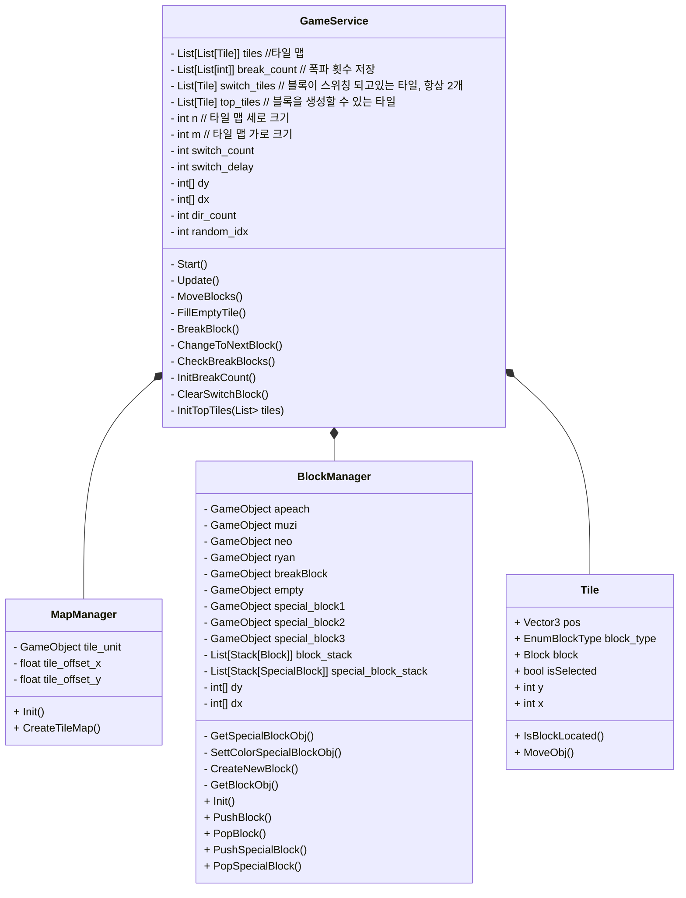

# friends_pop_demo

### 목적 : 프렌즈팝 모방, 연습용 프로젝트
* 핸드폰에서 실행했을때 의 영상 : https://youtu.be/Lc5WlTpR-3w

### 플랫폼 : Android
* Unity Editor 에서 실행할 경우 마우스로 컨트롤 한다.
* 핸드폰에서 실행할 때는 터치 적용.

### 클래스 구조

### 실행 방법
* 파일을 내려 받는다. (Code, Resources)
* 내려 받은 파일을 Unity Editor 의 `Asset` 밑으로 이동시킨다.
  * Asset/Code/
  * Asset/Resources/
* Unity Editor 에서 빈 오브젝트를 생성한다. `Create Epmpty`
  * 빈 오브젝트의 이름은 임의로 정한다. (예 : GameService)
  * 빈 오브제트에 Code/GameService.cs 스크립트를 추가한다. `AddComponent` `GameService.cs`
* 게임을 실행한다.

### 진행 상황
* 3매칭 블록 체크
  * 세로 / 오른쪽 아래 대각선 / 왼쪽 아래 대각선
  * 3개 이상 매칭 되었을 때는 스페셜 블록을 생성 시킨다.
* 빈 타일에 블록을 채우고 블록을 이동 시킨다.
* 사용자가 임의로 블록 두개를 이동 시킬 수 있다.
  * 블록 스위칭 했을 때 3매칭이 되지 않는다면, 다시 롤백한다.
* Application 종료 추가
  * X 버튼 누르면 종료 가능.
  * 뒤로 가기 누르면 종료 가능.

### TODO
* 스코어링 필요. 현재는 스코어링 하지 않기 때문에 게임이 끝나지 않는다.
* Application 종료 시 안내 문구 필요.
* 더 많은 종류의 스페셜 블록 생성.
* 스페셜 블록의 이펙트 개선.
